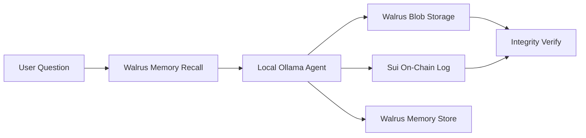

# ProofChain

**Verifiable AI audit trail — like ChatGPT for any decision, but every answer is provable.**

ProofChain is an autonomous AI agent whose every decision is stored on **Walrus Memory**, archived on **Walrus**, and anchored on **Sui**. Anyone can later prove exactly what the AI decided, when, and based on what — and instantly detect tampering.

Built for **Sui Overflow 2026** · Primary track: **Walrus** · Also demonstrates **Agentic Web**

---

## The problem

AI decisions today are a black box. You cannot prove what an model decided, whether reasoning was altered after the fact, or what it remembered from past sessions. Regulated industries (healthcare, legal, finance) need **auditability**, not just answers.

## The solution

```
Ask anything
  → Walrus Memory RECALL (past decisions)
  → Local AI agent ANSWERS
  → Walrus STORE (full reasoning blob)
  → Sui ANCHOR (tamper-proof hash + timestamp)
  → Walrus Memory REMEMBER (next session)
  → Anyone can VERIFY or detect TAMPERING
```

---

## Architecture



| Layer | Technology | Role |
|---|---|---|
| Agent | Ollama (local) | Decision + reasoning — no cloud API |
| Memory | Walrus Memory (`memwal`) | Recall past decisions across sessions |
| Storage | Walrus CLI | Full reasoning blobs off-chain |
| Proof | Sui Move contract | Immutable hash anchor on testnet |

---

## Live on Sui testnet

| Item | Value |
|---|---|
| Package ID | `0xf97628ba29937a7846cc83a077d04b9d0535bbc9f2107bbe5572bd21189eb809` |
| Module | `audit_log` |
| Function | `log_decision` |
| Explorer | [View package on SuiScan](https://suiscan.xyz/testnet/object/0xf97628ba29937a7846cc83a077d04b9d0535bbc9f2107bbe5572bd21189eb809) |

---

## Quick start

### Prerequisites

- Python 3.12+
- [Sui CLI](https://docs.sui.io/guides/developer/getting-started/sui-install) (configured for testnet)
- [Walrus CLI](https://docs.wal.app/) (`walrus` in PATH)
- [Ollama](https://ollama.ai/) with a model: `ollama pull gemma3:1b`
- Walrus Memory account — [walrus.xyz/products/walrus-memory](https://walrus.xyz/products/walrus-memory/)

### Install

```bash
git clone https://github.com/YOUR_USERNAME/proofchain.git
cd proofchain
python3 -m venv venv
source venv/bin/activate
pip install -r requirements.txt
```

### Configure Walrus Memory

```bash
cp .env.example .env
# Edit .env — paste your 64-char hex delegate key from the Walrus Memory dashboard
```

```bash
python test_memwal.py   # should print: memwal works
```

### Run the demo

```bash
# Terminal 1 — Ollama
ollama serve

# Terminal 2 — ProofChain UI
source venv/bin/activate
python app.py
```

Open `http://127.0.0.1:7860`

### CLI demo

```bash
python agent.py "" "Should we approve this high-cost treatment?"
python proofchain.py
```

---

## Demo flow (for judges)

1. **Ask** — type any decision question (any industry)
2. See Walrus blob ID + Sui explorer link
3. **Memory** — load past decisions from Walrus Memory
4. **Verify** — ✅ integrity check
5. **Simulate tampering** — 🚨 hash mismatch detected

---

## Project structure

```
proofchain/
├── app.py              # Gradio UI (demo site)
├── agent.py            # Ollama agent + pipeline orchestration
├── proofchain.py       # Walrus storage + Sui anchoring
├── memory.py           # Walrus Memory (memwal) integration
├── domains.py          # Universal domain + example questions
├── ui_theme.py         # Demo UI theme
├── audit_log/          # Sui Move smart contract
│   └── sources/audit_log.move
└── test_memwal.py      # Walrus Memory health check
```

---

## Hackathon

| Field | Value |
|---|---|
| Event | Sui Overflow 2026 (DeepSurge) |
| Primary track | **Walrus** |
| Also demonstrates | Agentic Web (autonomous agent acts on Sui) |
| Deadline | June 21, 2026 |

---

## Team

Prakash Raj K · Sui Overflow 2026

---

## License

MIT
